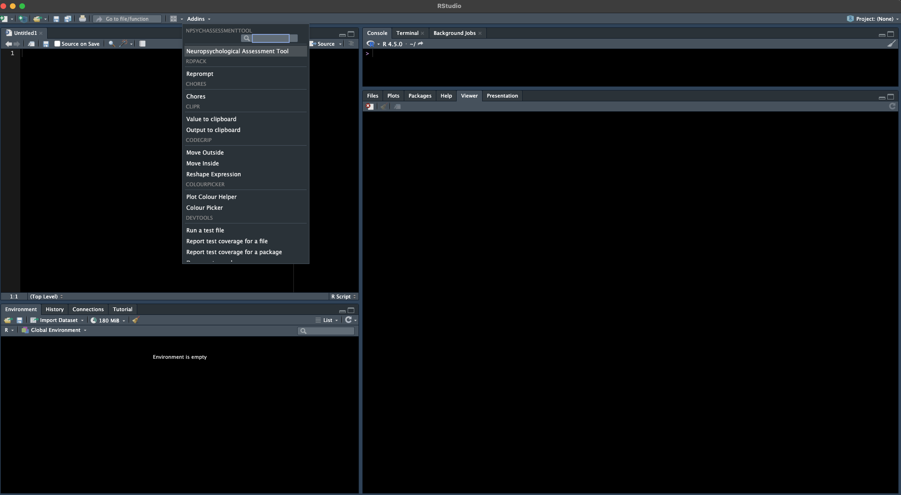

<!-- README.md is generated from README.Rmd. Please edit that file -->

```{r, include = FALSE}
knitr::opts_chunk$set(
  collapse = TRUE,
  comment = "#>",
  fig.path = "man/figures/README-",
  out.width = "100%"
)
```

# NpsychAssessmentTool

<!-- badges: start -->
[](https://github.com/rmtrane/NpsychAssessmentTool/actions/workflows/R-CMD-check.yaml)
<!-- badges: end -->

This package provides an [R Shiny](https://shiny.posit.co) application used for diagnosis cognitive status based on neuropsychological scores. 

## Installation

You can install the development version of NpsychAssessmentTool from [GitHub](https://github.com/) with:

``` r
# install.packages("pak")
pak::pak("rmtrane/NpsychAssessmentTool")
```

## Example

You can start the application as follows:

```{r example, eval=FALSE}
library(NpsychAssessmentTool)
shinyAssessmentApp()
```

Alternatively, the app is also available as an RStudio add-in. I.e., once the package is installed, you should be able to launch it from the RStudio add-in dropdown menu:

