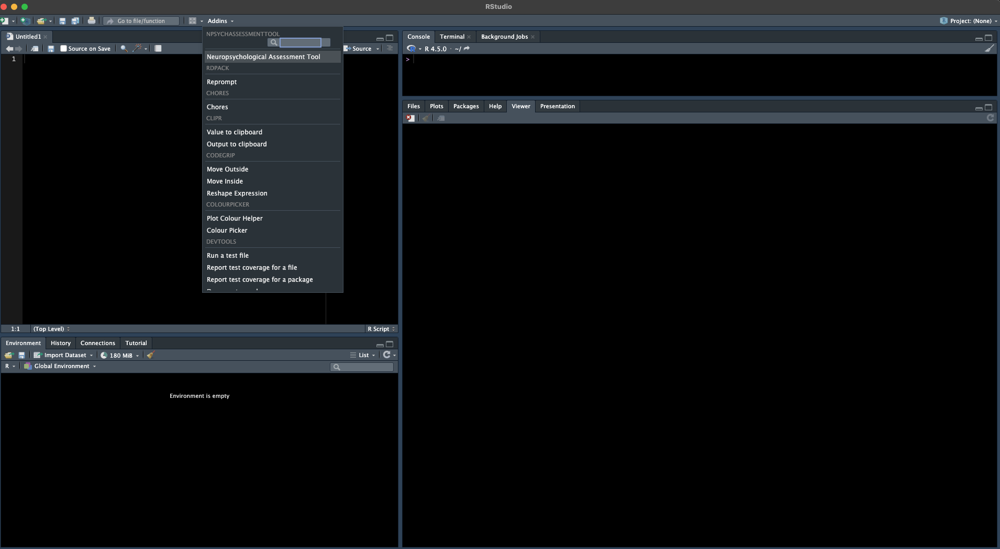

<!-- README.md is generated from README.Rmd. Please edit that file -->

# NpsychAssessmentTool

<!-- badges: start -->

[](https://github.com/rmtrane/NpsychAssessmentTool/actions/workflows/R-CMD-check.yaml)
[](https://codecov.io/gh/rmtrane/NpsychAssessmentTool)
<!-- badges: end -->

This package provides an [R Shiny](https://shiny.posit.co) application
used for diagnosis of cognitive status based on neuropsychological
scores.

## Installation

You can install the development version of NpsychAssessmentTool from
[GitHub](https://github.com/) with:

``` r
# install.packages("pak")
pak::pak("rmtrane/NpsychAssessmentTool")
```

or

``` r
# install.packages("remotes")
remotes::install_github("rmtrane/NpsychAssessmentTool")
```

Note that some features of the application mean additional resources.
For example, the R package
[`REDCapR`](https://ouhscbbmc.github.io/REDCapR/) is necessary to be
able to pull data straight from REDCap. To install the packages needed
to enable all features, use

``` r
pak::pak("rmtrane/NpsychAssessmentTool", dependencies = TRUE)
```

or

``` r
remotes::install_github("rmtrane/NpsychAssessmentTool", dependencies = TRUE)
```

## Example

You can start the application as follows:

``` r
library(NpsychAssessmentTool)
shinyAssessmentApp()
```

Alternatively, the app is also available as an RStudio add-in. I.e.,
once the package is installed, you should be able to launch it from the
RStudio add-in dropdown menu:

<figure>

<figcaption aria-hidden="true">Screenshot showing the RStudio
add-in.</figcaption>
</figure>
